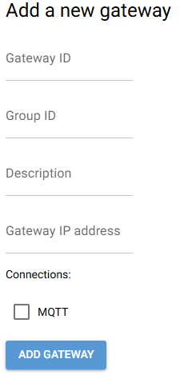

# Configure Gateway

This guide explains how to configure a gateway using the Infrastructure Manager UI before connecting it to devices like PLCs or USB microphones.

---

## 1. Provide Gateway Information

Before a gateway can be connected and managed, some basic details must be defined:

- **Gateway ID**  
  A unique identifier for the gateway.  
  Example: `gateway_1` or a descriptive name like `robot_cell_gateway`.

- **Group ID**  
  The group or line the gateway belongs to.  
  Example: `production_line_3` or `assembly_area_A`.

- **Description**  
  A short description that provides context on the gateway's location or purpose.  
  Example: *"Gateway in robot cell A, connected to Siemens PLC and USB microphone for process monitoring."*

---

## 2. Enter Connection Details

You’ll need to enter the following information to establish communication:

- **Gateway IP Address**  
  The IP address of the physical gateway device (where the configuration software is installed).

- **Connection Type**  
  The protocol used for backend communication.  
  > Currently, only **MQTT** is supported.

---

## 3. Add the Gateway

Once all the required fields are filled out, press the **"ADD gateway"** button.

If the configuration is successful, a confirmation message will appear.
> The configuration might take a minute or two

The gateway will then be visible and manageable from the **"Manage Gateways"** tab.

---

## 4. UI Reference

Below is an example of the configuration screen (replace with actual screenshot):

