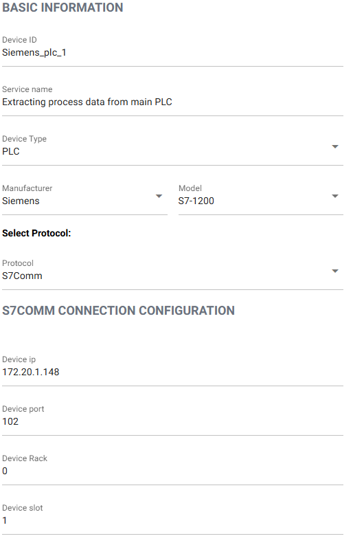
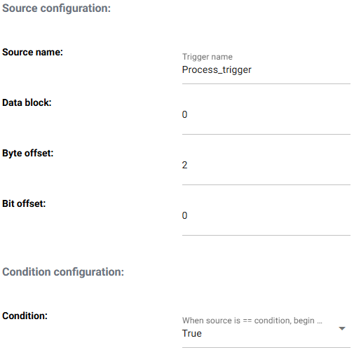
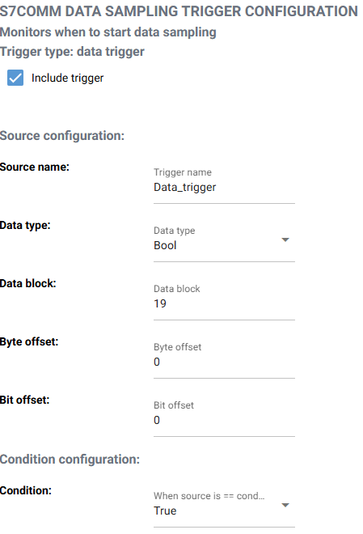
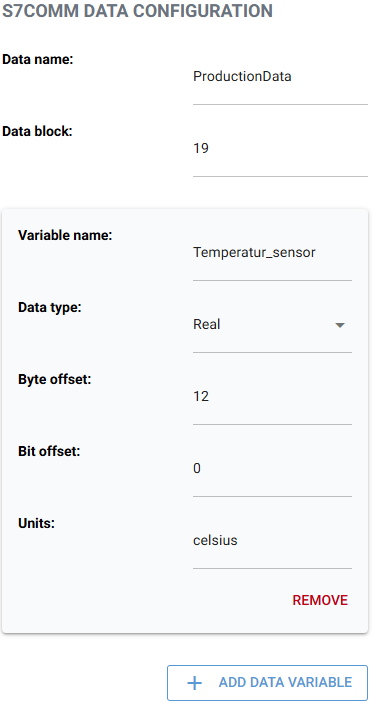
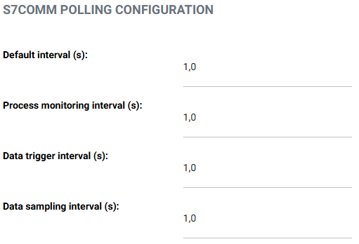

# Guide: Connect Gateway to Siemens PLC

This guide describes how to configure the gateway to collect data from a Siemens PLC.

> **Note:** This setup has only been tested with **Siemens S7-1200** PLCs.

---

## Prerequisites

Before configuring the connection, gather the following information:

- **Device ID** of the PLC (Give it a unique ID)
- **Service Name** give the service a name which describes the purpose of ot
- **IP address** of the PLC
- **Subnet** the PLC is on
- **Port** (use the default unless changed)
- **Rack** and **slot** (default: rack `0`, slot `1` unless changed)
- **PLC Model** (currently supported: `S7-1200`)

Add this information into their respective fields in the UI as displayed below:

---

## Step 1: Configure Process Monitoring

The service checks a **memory bit** in the PLC to determine if the process is running.

You’ll need the following details:

- **Data block number**
- **Byte offset**
- **Bit offset** within the byte
- Whether to signal process activity when the memory bit is:
  - `True` (bit is 1) or
  - `False` (bit is 0)

Add this information into their respective fields in the UI as displayed below:

---

## Step 2: (Optional) Configure a Data Trigger

A data trigger determines when to start sampling the PLC.

- Currently only supports **boolean values** inside a data block.
- Required information:
  - **Data block number**
  - **Byte offset**
  - **Bit offset**
  - Whether to trigger sampling when the bit is `True` or `False`

Add this information into their respective fields in the UI as displayed below:

---

## Step 3: Configure Data Collection

You can configure data collection from one data block at a time.

Click the **"Add data variable"** button for each variable you want to extract. For each:

- **Name** – Describe the variable (e.g., `MotorSpeed`)
- **Data type** – Supported types: `INT`, `REAL`, `BOOL`
- **Byte offset** – Where the variable starts
- **Bit offset** – Only for `BOOL` values
- **Unit** – (e.g., `rpm`, `bar`, `celcius`) for context

You may add multiple variables by clicking the button again.

Add this information into their respective fields in the UI as displayed below:

---

## Step 4: Set Sampling Intervals

Set how often data is collected:

- **Data trigger interval** – How often to check the trigger
- **Data sampling interval** – How often to collect data

> Default is **1 second** for both.  
> Sampling at **0.2 seconds** has been tested without visible issues,  
> but lower values may cause high load on the PLC.

---

Ensure all the required fields are filled correctly, then proceed with the configuration by clicking "ADD SERVICE".
The configuration of the service might take a couple of minutes

Once configured, the gateway will begin collecting data from the Siemens PLC and store it in the database.

