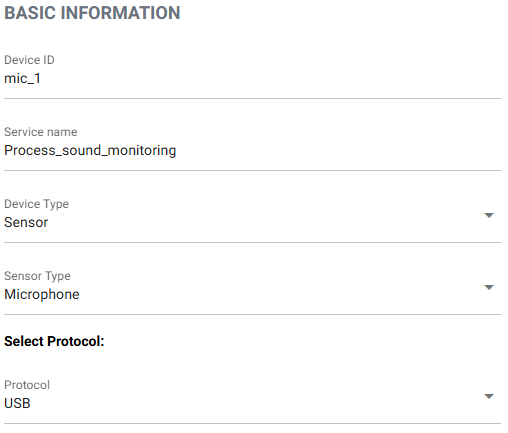
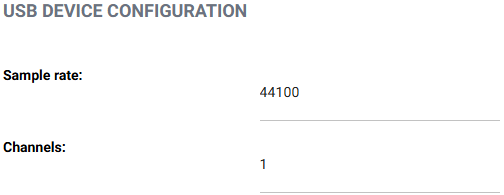
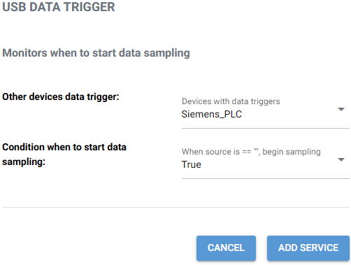

# Guide: Connect Gateway to USB Microphone

This guide explains how to configure a gateway to collect audio data from a USB microphone.

---

## Step 1: Basic Device Setup

To begin configuration:

1. **Select a device ID** – This should be a unique identifier (e.g., `mic_01` or `inspection_microphone`)
2. **Enter a service name** – A descriptive name for the service (e.g., `sound_monitoring`)
3. **Device type** – Select `Sensor`
4. **Sensor type** – Select `Microphone`
5. **Protocol** – Select `USB`

---

## Step 2: Microphone Configuration

Next, provide technical details about the USB microphone:

- **Sample rate** – e.g., `16000 Hz`, `44100 Hz`, `48000 Hz`
- **Number of channels** – e.g., `1` for mono, `2` for stereo

Make sure your microphone supports the settings you enter.

---

## Step 3: Set Recording Trigger

Since USB microphones don't provide native hardware triggers, you must link recording to a **data trigger** already configured on the gateway.

1. **Choose an existing trigger** – You’ll see a list of all available triggers on the gateway.
2. **Select the condition** – Choose whether to start recording when the selected trigger is:
   - `True` (active)
   - or `False` (inactive)

> This allows the microphone to begin recording in sync with an external event, such as a PLC signal or machine status flag.

---

Once all fields are configured, click "ADD SERVICE". Then, the service will be configured to begin capturing audio from the USB microphone based on the defined logic.

